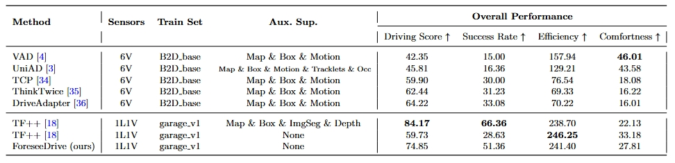
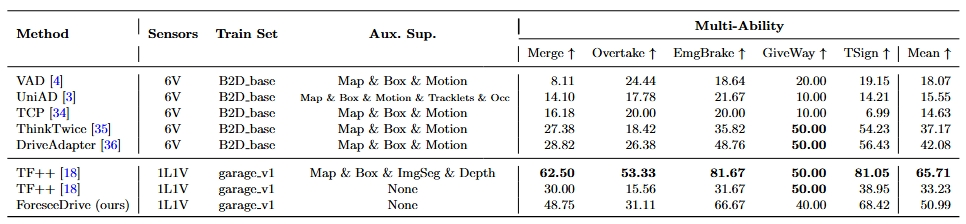
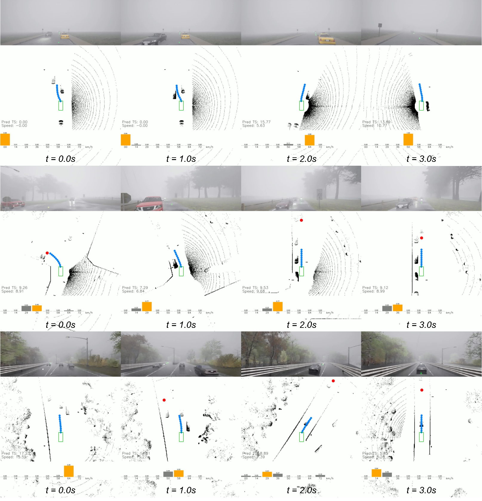
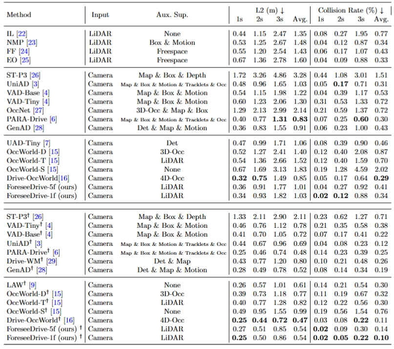

# ForeseeDrive
ForeseeDrive: Self-supervised End-to-end Driving with Future Occupancy Forecasting

## Abstract
End-to-end driving is becoming an emerging solution for the next-generation driving systems. Compared to a modular architecture, the end-to-end pipeline features no loss of perceptual information in downstream planning tasks and faster model iteration compared to rule-based architectures. However, due to the complexity of end-to-end networks, prior art introduces a variety of intermediate tasks such as intermediate supervision to accelerate network convergence, but these annotations are expensive, which greatly limits the scalability of end-to-end driving. To this end, this paper proposes a novel self-supervised end-to-end driving framework, ForeseeDrive, that does not learn from any manually labeled annotations, but only from raw point cloud sequences. The main idea is to formulate perception and prediction as unsupervised predictions of future point clouds and predict future ego trajectories in parallel. ForeseeDrive greatly simplifies the process of perception and prediction pipeline but ensures the safety of planning by greatly reducing the collision rate. We also investigate multiple interaction approaches between prediction and planning and find that the parallel architecture performs the best in terms of efficiency and accuracy. ForeseeDrive with cameras as input achieves competitive open-loop occupancy forecasting and planning performance on nuScenes dataset and ForseeDrive with LiDAR and front-view camera as input achieves a success rate of 51.36\% and a driving score of 74.85 on the closed-looped CARLA bench2drive test routes.

## Results
Result on CARLA Bench2Drive closed-loop planning. Detailed results under CARLA metrics are in [results](https://cloud.tsinghua.edu.cn/d/f5048727f38b425fbf29/). Demo videos are in [videos](https://cloud.tsinghua.edu.cn/d/1be44f7cf29c4f29b58d/).

Result on nuScenes open-loop planning. Detailed results under UniAD/VAD/BEV-Planner metrics are in [results](https://cloud.tsinghua.edu.cn/d/abaad10c591b4041b13b/)

## Future Plan
Models on nuScenes and Carla Bench2drive benchmarks are expected to release after the decision of a double-blinded journal.

## Acknowledgements
Thanks to prior excellent open source projects:

- [ViDAR](https://github.com/OpenDriveLab/ViDAR)
- [carla_garage](https://github.com/autonomousvision/carla_garage)
- [BEV-Planner](https://github.com/NVlabs/BEV-Planner)

